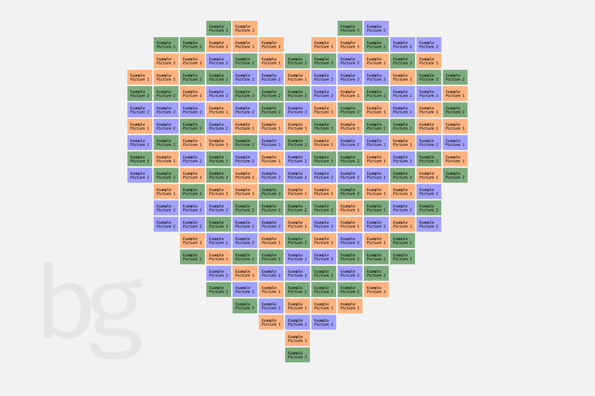

A Python script that arranges the pictures in a heart shape similar to the one above. The more pictures you have, the better the effect.

Modify the parameters in `place_heart.py` and run it directly.

You can modify the curve function to achieve different shapes.

---

创建类似上图的心形图片排列的Python脚本，图片越多，效果越好。

修改`place_heart.py`内参数直接运行即可。

可以修改曲线函数来实现不同的形状。
